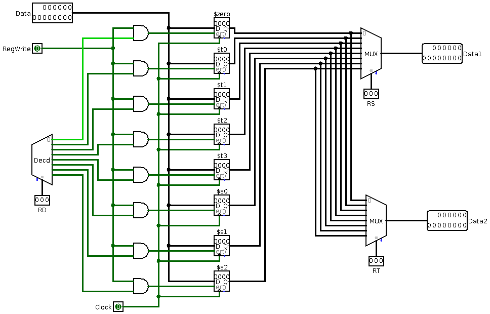
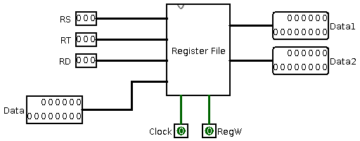
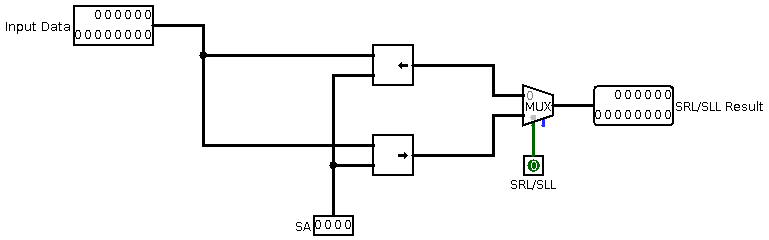

# 14-bit-RISC-CPU-Implementation
14-bit CPU implementation in Logisim. This is a 14-bit RISC CPU logisim implementation. All files are included in this single repository. Datapath, Register Circut,Register File
1 bit ALU, 14 bit ALU, Final ALU, Control Signals and Control Unit

# Designed by Uttam Kumar Saha

# Datapath Design:

# Register Circuit:

# Register File:

# ALU Circuit:

# 1-bit ALU:

# 14 bit ALU:

# Final ALU:

# Shifter Circuit:

# Control Signals Circuit 1:

# Control Signal Circuit 2:

# Control Unit 1:

# Control Unit 2:

